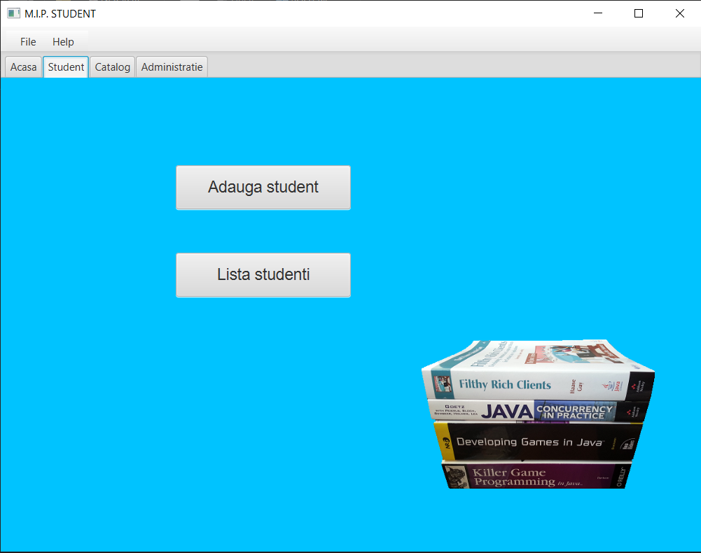
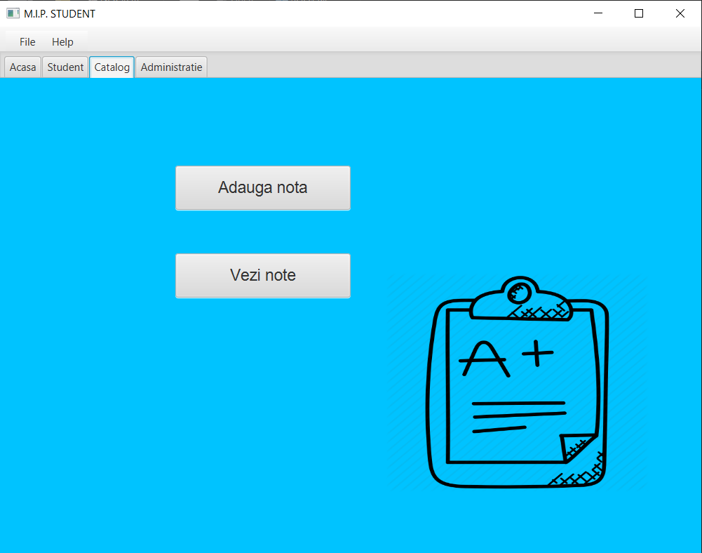
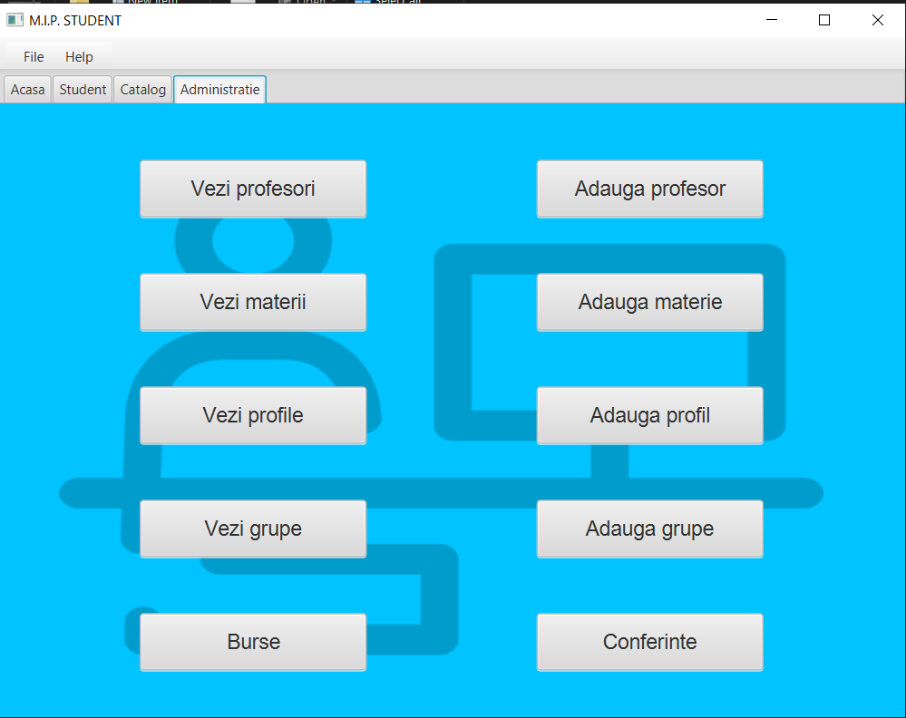
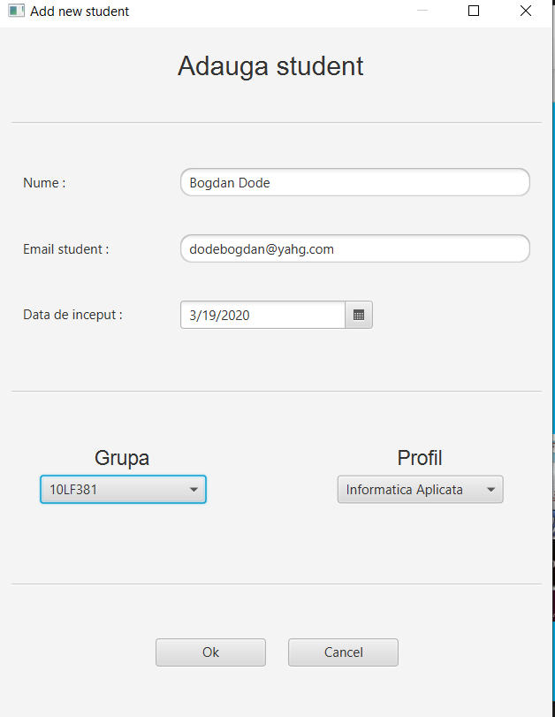
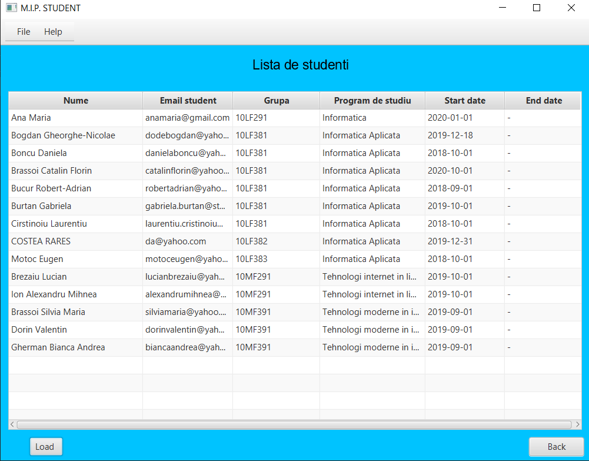
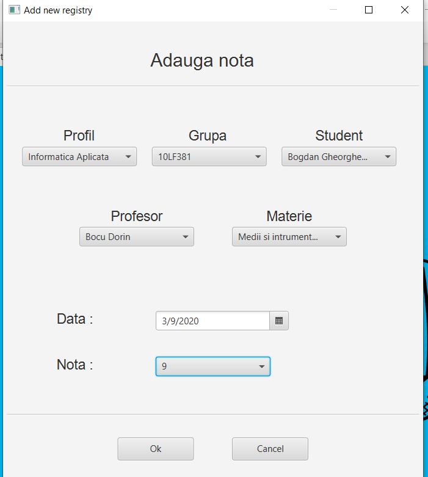
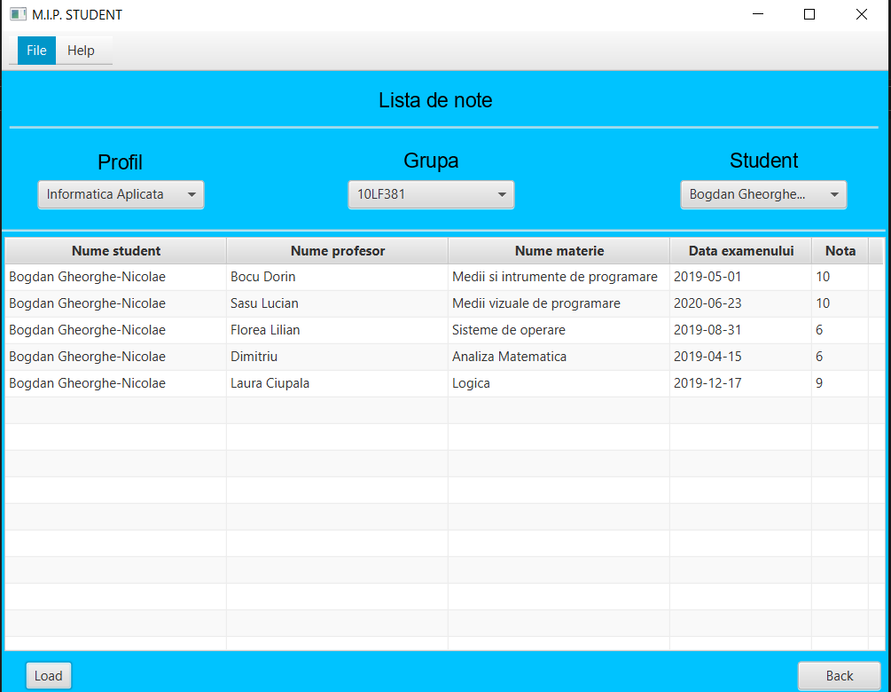

# Management-System
Homework for course of Java.

This project contains the management of the students and the teachers of an university allowing access to the grades, list of the teachers and list of the students which are loaded from data base. Grades, students and teachers can be added in the data base. The data base is made with MySQL.

There are some demos about how the application it looks.

If you want to add a student you need first to gave him a name that must be atleast 3 characters, a valid email (characters,@,and dot(.)), a date, and you have to select Group and Profile in witch you want to add. The Group and Profile must be added first. 

